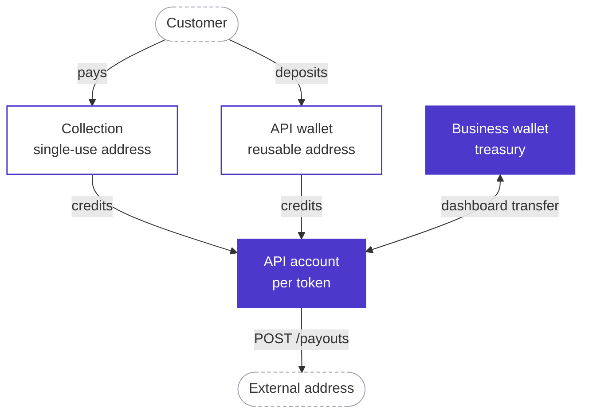
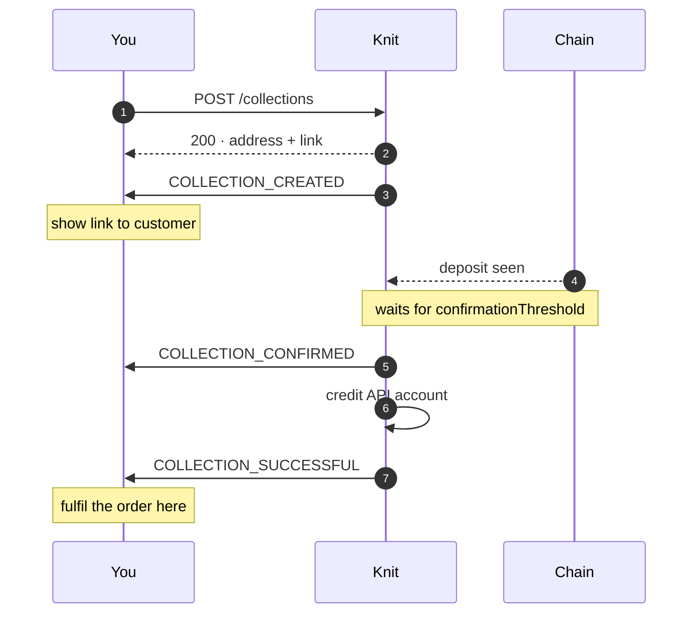
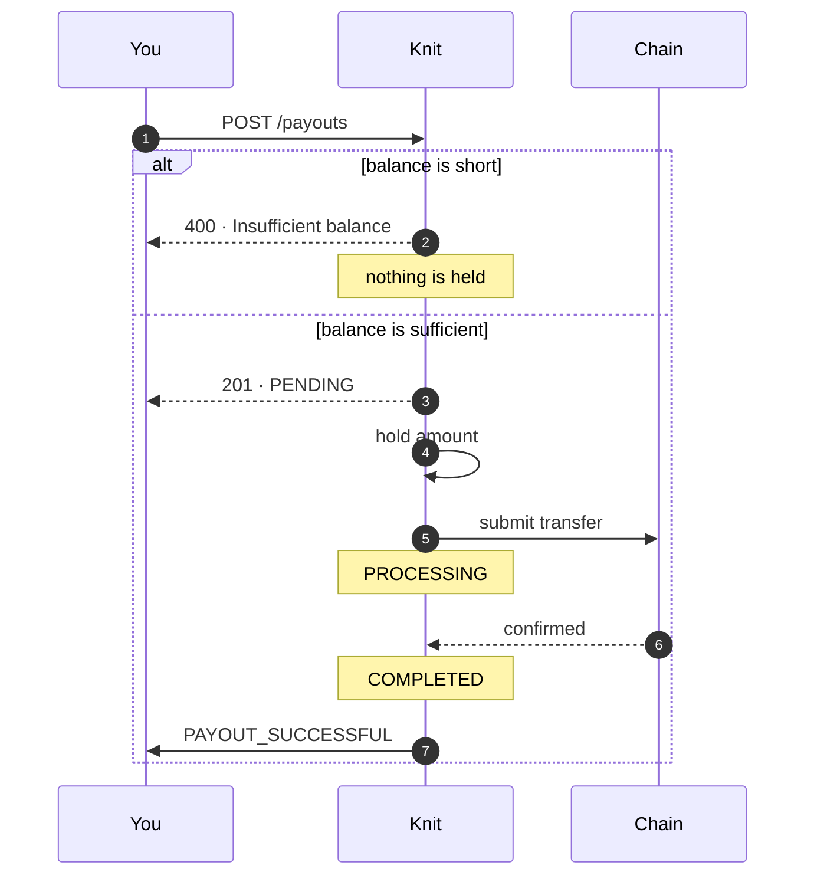
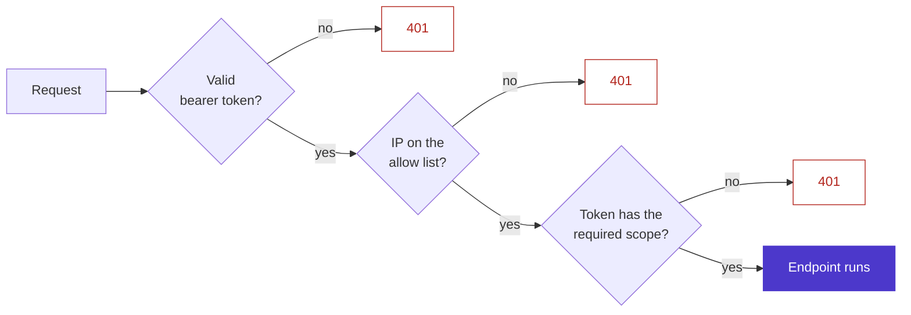

# How money moves

Knit separates the funds you hold from the funds your integration can spend.
Understanding that split is the fastest way to reason about balances, payout
failures, and webhook side effects.

## The two balances

<Fields>
  <Field name="Business wallet" type="treasury">
    Your main balance. Deposits from the dashboard land here, and manual
    withdrawals are made from here. Programmatic API calls never spend from it.
  </Field>
  <Field name="API account" type="per-token spendable balance">
    A balance per token (USDT, USDC) that funds API activity. Collections and
    wallet deposits credit it; payouts debit it. This is the balance your
    integration actually draws on.
  </Field>
</Fields>

Collections, API wallets, and payouts do not carry their own spendable
balances. Every movement they represent settles against the API account.



The two filled boxes are the balances. Everything else is a route value passes
through.

Everything with an arrow into the API account increases what you can pay out.
Only the dashboard transfer moves value between the two balances — no API call
does.

<Callout type="info">
  Where a response includes `balanceBefore` and `balanceAfter`, those values
  describe the API account ledger for that token. Watching them is the most
  direct way to know how much runway your integration has left.
</Callout>

## The flows

<Steps>

### Fund the API account

Move USDT or USDC from your business wallet into the API account from the
dashboard. This is deliberately a manual step, so you control the ceiling on
what programmatic flows can spend.

Create the account first if it does not exist —
[`POST /api/v1/business-api-services-wallets`](/API-account/create-an-API-account)
creates the record with a zero balance; it does not move funds.

### Collections credit it

Each [collection](/collections/create-a-collection) issues a single-use address.
When the deposit is confirmed on-chain, the proceeds are credited to the API
account for that token. No transfer step is needed.

### API wallet deposits credit it

Deposits into a reusable [API wallet](/wallets/create-a-wallet) are recorded as
wallet transactions and credited to the API account, so the funds are
immediately available for payouts.

### Payouts debit it

[`POST /api/v1/payouts`](/payouts/create-a-single-payout) checks the API
account balance for the requested token, holds the amount, and submits the
transfer. If the balance is short, the payout is rejected with `400` and
nothing is held.

### Return unused balance

To move value back to the business wallet, use the transfer action in the
dashboard.

</Steps>

## A collection, end to end

Where the webhooks land relative to the money moving:



## A payout, end to end



Only `COMPLETED` produces a webhook. A payout that ends `FAILED` is discovered
by reading it back — see [Get payout status](/payouts/get-payout-status).

## Request lifecycle

Every authenticated request goes through the same three checks before it
reaches an endpoint:



1. **Token.** The bearer token is validated and resolved to an OAuth client and
   the business it belongs to.
2. **Network.** The caller's IP must be on the business allow list.
3. **Scope.** The token must satisfy the scope the route requires, for example
   `payouts:write` for `POST /api/v1/payouts`.

All three failures are `401`, with a message naming the check that failed. See
[Authentication](/authentication) for the exact strings.

## Observability

- **Webhooks.** Every significant state change is delivered to your endpoint,
  signed with your webhook secret, and retried on failure. See
  [Webhooks](/webhooks).
- **Dashboard.** Request volume, success and error rates, collection and payout
  history, and webhook delivery attempts are all visible in the dashboard.
- **Reconciliation.** Every collection and payout carries a stable `id`, and
  payouts additionally carry your own `merchantReference`, so you can reconcile
  against your ledger without relying on webhook ordering.

## Response format

All endpoints return the same envelope, so you can parse success and failure
identically. See [Requests & responses](/conventions) for status codes and
validation details.

```json filename="Envelope"
{
  "statusCode": 200,
  "message": "Payout created successfully",
  "data": {},
  "success": true
}
```
